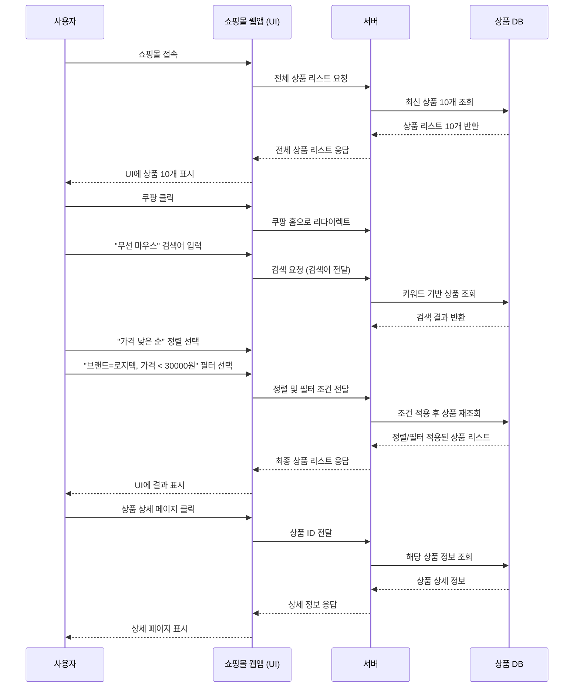

# 🌟 소프트웨어 공학 - 개인과제

- '일상속 상품 검색 기능'을 구현한 프로젝트

---

## 1. 프로젝트 개요

* 사용자가 상품을 검색하고 조건만출 (브랜드 / 가격) 후 검색결과 보기
* 반환된 검색 결과에서 하나를 선택하여 상세정보 확인

---

## 2. 프로젝트 프로세스 플로우차트 (Mermaid Flowchart)



---

## 3. 구현을 위한 파이썬 코드
```

```


### 사용 클래스:


### 구현 목적:


---

## 4. 파이썬 코드 클래스 구조

```plaintext
shopping_flow.py
|
|│-- Product: 상품의 정보 (이름, 가격, 브랜드)
|│-- ProductStore: 전체/검색/필터/상세 조회 가능
|│-- User: 가입 행동을 시루리얼로 실행
```

---

## 5.

| 키점     | 가지가 있다         | 판단 |
| ------ | -------------- | -- |
| 개발 단순성 | 클래스 3개 이하      | 가능 |
| 유지법    | 클래스간 가능한 최소 가열 | 가능 |
| 검증효    | 다양한 검증자 만들기 여유 | 가능 |

---

## 6. 결론

---
