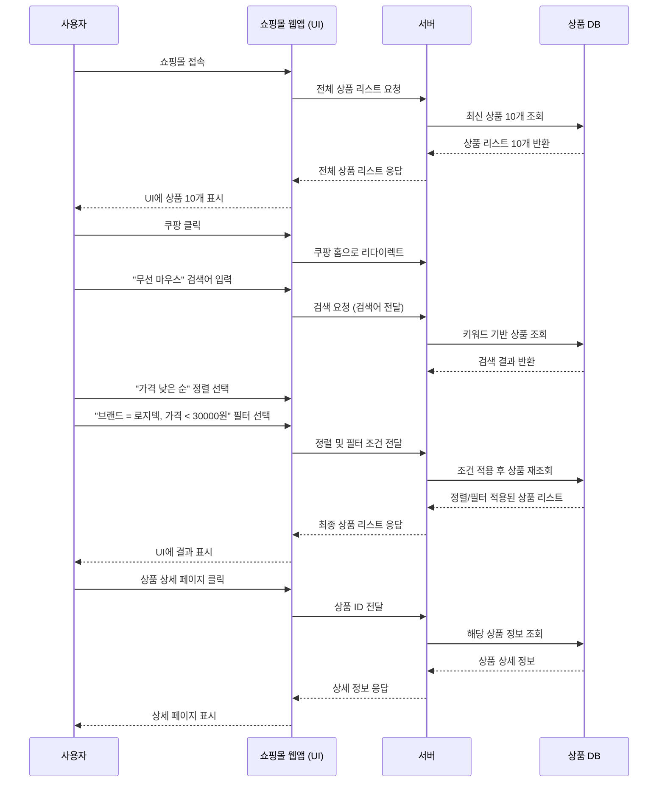

# 🌟 소프트웨어공학 - 개인 실습 과제

- '일상 속 상품 검색 기능'을 구현한 프로젝트
- 작업순서 [🔗 프로젝트 링크](https://github.com/users/yewonseowill/projects/1) 


---

## 1. 프로젝트 개요

* 사용자가 상품을 검색하고 조건(브랜드 / 가격)에 맞는 검색결과 보기
* 반환된 검색 결과에서 하나를 선택하여 상세정보 확인
  


---

## 2. 프로젝트 프로세스 플로우차트 (Mermaid Flowchart)


## 🔗 Mermaid 시퀀스 다이어그램

[▶ Mermaid 다이어그램 열기](https://www.mermaidchart.com/play?utm_source=mermaid_live_editor&utm_medium=toggle#pako:eNqdVE1rGlEU_SsXIZBAYk3TlbSBBjfuCkW6cWPNUFzUWDXdlIIfk9RE02gaW6OjjCU1pDVlohMwIPS_dDnvvv_Qq-9px4xjSmc1zJx77znnvvPeeaI724rH70kpb3aVeFQJxCKvkpHX4TjQs7QEmOti_RJb5VVAXcWeCZjP8pMCYNvg9RL83j8Bq5fB_MH4FfUq07sPeFXlqiG-5LOoDoD1TWtgWLclvMhgszZpxptl1lHDcTEvEUmmY9FYIhJPQyilJCGS-kvACXmhvHyaSIxBH4a8WmHfDcDGLVavYTkUXHEWPFeSb2VXVWM91Yl4ltzZ3o2mA1tjkFAa2JrwIz983js-sE4XD8_54QDQLJBEYG2NfdJEwUjE2uamIOq309QruH8kQOIvwQQ9v_uA-in2rkSRwFLRlDHV3WhY1Cd16z7L0OSaRM0UumYfdneKqGNGjZ_VZmbZhbgxbFZY8WZGFlWNXPBDKIhfyrPkeIUIazZ3173AT0us9YMfD2lHOs835xv5S-elNvCsyTpXbi5KzFkBtSEtZUSTFc-xaTL9gMjaxj70yjM8d1jYw7omkQF2UcC6QVLDHonHz2RCa4_p31xIyGiIzcGyrUpXWbG74r5MnjvHRolOEtChom3M5m7BQuVIq2dY_eF0j1OtG14ZUvp1DDKoqGcpZC7qLSNj9S6B5X5iMwNY0Ei-bLFgReTagDY5ysITcp9iz_eOVkE2ewwbPnqwUaZmExK2ZnMy4eDcNqzriZELQjGBjRQCb6hTI1vd-8Mxc52JHqysOQ6-a04okV_3_icncn2OhDzyzt6o8-MhFQog_1ijQ08LuCcvoigYuNdSXjVZ8XY6hTzqm_980UhSosrVNztooVtOjWPHPO__AAJKRJI)

:white_check_mark:
 **Mermaid실행 화면**


<br>
<br>

:white_check_mark:
 **Mermaid SequenceDiagram 화면**




---

## 3. 구현을 위한 파이썬 코드(개선전)
```
# shopping_flow.py

from typing import List, Optional  # 타입 힌트를 위한 모듈

# ✅ 상품 클래스: 개별 상품의 정보를 저장하는 객체
class Product:
    def __init__(self, product_id: int, name: str, brand: str, price: int):
        self.product_id = product_id  # 상품 고유 ID
        self.name = name              # 상품 이름
        self.brand = brand            # 브랜드명
        self.price = price            # 가격

    def __repr__(self):
        # 상품 정보를 문자열로 표현할 때 사용
        return f"{self.name} ({self.brand}) - {self.price}원"

# ✅ 상품 저장소 클래스: 상품 목록을 보관하고 검색/필터/조회 기능 제공
class ProductRepository:
    def __init__(self):
        # 초기 상품 10개를 리스트에 저장
        self.products = [
            Product(1, "로지텍 무선 마우스", "로지텍", 25000),
            Product(2, "HP 유선 마우스", "HP", 15000),
            Product(3, "로지텍 게이밍 마우스", "로지텍", 45000),
            Product(4, "삼성 블루투스 마우스", "삼성", 29000),
            Product(5, "LG 유선 마우스", "LG", 18000),
            Product(6, "로지텍 무선 키보드", "로지텍", 32000),
            Product(7, "애플 매직 마우스", "애플", 79000),
            Product(8, "델 유선 마우스", "델", 14000),
            Product(9, "MS 블루투스 마우스", "MS", 31000),
            Product(10, "로지텍 사일런트 마우스", "로지텍", 27000),
        ]

    # 전체 또는 최신 상품 일부 반환
    def get_latest_products(self, count: int = 10) -> List[Product]:
        return self.products[:count]

    # 키워드가 포함된 상품 검색
    def search(self, keyword: str) -> List[Product]:
        return [p for p in self.products if keyword in p.name]

    # 브랜드 및 가격 필터링
    def filter(self, products: List[Product], brand: Optional[str], max_price: Optional[int]) -> List[Product]:
        filtered = products
        if brand:
            filtered = [p for p in filtered if p.brand == brand]
        if max_price:
            filtered = [p for p in filtered if p.price <= max_price]
        return filtered

    # 상품 ID로 상세 정보 조회
    def get_detail(self, product_id: int) -> Optional[Product]:
        for p in self.products:
            if p.product_id == product_id:
                return p
        return None

# ✅ 웹 앱 클래스: 저장소를 통해 사용자 요청을 처리
class WebApp:
    def __init__(self, repository: ProductRepository):
        self.repo = repository  # 저장소 주입

    # 메인 페이지용 최신 상품 불러오기
    def load_home(self):
        return self.repo.get_latest_products()

    # 검색 + 필터 + 정렬 처리
    def search_products(self, keyword: str, brand: Optional[str], max_price: Optional[int]):
        result = self.repo.search(keyword)
        return sorted(self.repo.filter(result, brand, max_price), key=lambda x: x.price)

    # 상품 ID로 상세 정보 반환
    def show_detail(self, product_id: int):
        return self.repo.get_detail(product_id)

# ✅ 사용자 클래스: 실제 사용자가 서비스를 이용하는 흐름을 시뮬레이션
class User:
    def __init__(self, app: WebApp):
        self.app = app

    def run(self):
        print("📲 쇼핑몰 접속")

        # 홈에 접속했을 때 최신 상품 목록 출력
        latest = self.app.load_home()
        print("🛒 최신 상품 리스트:")
        for p in latest:
            print("-", p)

        # '마우스' 검색 후 필터 적용
        print("\n🔍 '마우스' 검색 + 로지텍 브랜드 + 가격 ≤ 30000원")
        filtered = self.app.search_products("마우스", "로지텍", 30000)
        for p in filtered:
            print("🎯 검색결과:", p)

        # 검색 결과 중 첫 번째 상품 상세 보기
        if filtered:
            detail = self.app.show_detail(filtered[0].product_id)
            print("\n📄 상세 페이지:")
            print("📝", detail)

# ✅ 메인 실행 로직
if __name__ == "__main__":
    repo = ProductRepository()  # 저장소 생성
    app = WebApp(repo)          # 웹앱 생성 (저장소 주입)
    user = User(app)            # 사용자 생성 (웹앱 주입)
    user.run()                  # 시뮬레이션 실행

```

🔗 [Google Colab Code Link](https://colab.research.google.com/drive/1-5BSQHrmf6QDwBGMkTixB7D0aH5T5tDb?usp=sharing)


:white_check_mark:
 **실행결과**


---

## 4. 파이썬 코드 클래스 구조(개선전)

```plaintext
shopping_flow.py
|
|│-- Product: 상품의 정보 (이름, 가격, 브랜드)
|│-- ProductStore: 전체/검색/필터/상세 조회 가능
|│-- User: 가입 행동을 시루리얼로 실행
```

---

## 5. 응집도/결합도(개선전)
⸻

🧠 응집도 및 결합도 평가

✅ **응집도(Cohesion) 평가**
<br>


📌 모든 클래스가 하나의 책임에 집중하여 유지보수가 매우 쉬운 구조임.

⸻

🔗 **결합도(Coupling) 평가**
<br>


📌 클래스 간 의존성이 낮은 편이나, 추상화 인터페이스가 도입되면 결합도를 더 낮출 수 있음.

⸻

📊 **종합 평가 요약**
<br>


⸻

💡 **개선 아이디어**
- ProductRepository를 인터페이스(ProductStoreInterface)로 추상화하여 WebApp이 인터페이스에 의존하도록 개선
- User 클래스가 WebApp에만 의존하지 않도록 서비스 계층 또는 컨트롤러 분리 시 확장성 향상 가능

⸻
# 🛍 개선된 Python 쇼핑몰 검색 시스템

Python으로 구현된 본 프로젝트는 구조 개선을 통해 **응집도는 유지하면서 결합도는 낮춘 예제**

---

## 📁 프로젝트 구조

```plaintext
shopping_flow/
├── product.py             # Product 클래스 정의
├── store_interface.py     # ProductStoreInterface 정의 (추상화)
├── repository.py          # ProductRepository 구현체
├── webapp.py              # WebApp 로직 처리 (인터페이스에 의존)
├── service.py             # AppService 계층 (사용자 흐름 실행)
└── main.py                # 실행 진입점
```

```
### 개선된 코드 ###
from typing import List, Optional, Protocol

# 상품 클래스
class Product:
    def __init__(self, product_id: int, name: str, brand: str, price: int):
        self.product_id = product_id
        self.name = name
        self.brand = brand
        self.price = price

    def __repr__(self):
        return f"{self.name} ({self.brand}) - {self.price}원"

# 추상 인터페이스
class ProductStoreInterface(Protocol):
    def get_latest_products(self, count: int) -> List[Product]: ...
    def search(self, keyword: str) -> List[Product]: ...
    def filter(self, products: List[Product], brand: Optional[str], max_price: Optional[int]) -> List[Product]: ...
    def get_detail(self, product_id: int) -> Optional[Product]: ...

# 구현체
class ProductRepository(ProductStoreInterface):
    def __init__(self):
        self.products = [
            Product(1, "로지텍 무선 마우스", "로지텍", 25000),
            Product(2, "HP 유선 마우스", "HP", 15000),
            Product(3, "로지텍 게이밍 마우스", "로지텍", 45000),
            Product(4, "삼성 블루투스 마우스", "삼성", 29000),
            Product(5, "LG 유선 마우스", "LG", 18000),
            Product(6, "로지텍 무선 키보드", "로지텍", 32000),
            Product(7, "애플 매직 마우스", "애플", 79000),
            Product(8, "델 유선 마우스", "델", 14000),
            Product(9, "MS 블루투스 마우스", "MS", 31000),
            Product(10, "로지텍 사일런트 마우스", "로지텍", 27000),
        ]

    def get_latest_products(self, count: int = 10) -> List[Product]:
        return self.products[:count]

    def search(self, keyword: str) -> List[Product]:
        return [p for p in self.products if keyword in p.name]

    def filter(self, products: List[Product], brand: Optional[str], max_price: Optional[int]) -> List[Product]:
        result = products
        if brand:
            result = [p for p in result if p.brand == brand]
        if max_price:
            result = [p for p in result if p.price <= max_price]
        return result

    def get_detail(self, product_id: int) -> Optional[Product]:
        for p in self.products:
            if p.product_id == product_id:
                return p
        return None

# WebApp 클래스
class WebApp:
    def __init__(self, store: ProductStoreInterface):
        self.store = store

    def load_home(self):
        return self.store.get_latest_products(10)

    def search_products(self, keyword: str, brand: Optional[str], max_price: Optional[int]):
        results = self.store.search(keyword)
        filtered = self.store.filter(results, brand, max_price)
        return sorted(filtered, key=lambda x: x.price)

    def show_detail(self, product_id: int):
        return self.store.get_detail(product_id)

# 사용자 흐름 담당 서비스 계층
class AppService:
    def __init__(self, app: WebApp):
        self.app = app

    def simulate_user_flow(self):
        print("📲 쇼핑몰 접속")
        for p in self.app.load_home():
            print("🛒", p)

        print("\n🔍 '마우스' 검색 + 로지텍 브랜드 + 가격 ≤ 30000원")
        filtered = self.app.search_products("마우스", "로지텍", 30000)
        for p in filtered:
            print("🎯", p)

        if filtered:
            print("\n📄 상세 페이지:")
            print("📝", self.app.show_detail(filtered[0].product_id))

# 실행부
if __name__ == "__main__":
    store = ProductRepository()
    web_app = WebApp(store)
    service = AppService(web_app)
    service.simulate_user_flow()

 ```

---

# 📊 구조 개선 전후 응집도 및 결합도 비교 보고서

쇼핑몰 시스템의 두 가지 구조(기존 구조 vs 개선 구조)에 대해 **응집도(Cohesion)** 및 \*\*결합도(Coupling)\*\*를 정량적 및 시각적으로 비교 분석한 결과

---

## 🧩 분석 목적

* 구조 설계 변경의 효과를 정량적으로 검증
* 인터페이스 도입과 계층 분리(AppService) 도입이 시스템 구조에 미치는 영향 분석
* 응집도는 높을수록, 결합도는 낮을수록 좋은 구조로 간주

---

## ⚙️ 분석 방법

* **AST 파싱을 이용한 정적 분석**을 통해 다음을 평가:

  * 클래스 내 메서드들의 `self` 필드 공유 → **응집도 점수 산출**
  * 명시적 객체 생성 및 인터페이스 사용 여부 → **결합도 점수 산출**

### ✅ 응집도 산출 방식

* 각 클래스 내 메서드 쌍이 **공통 필드를 사용할 경우 1점**
* 전체 메서드쌍 중 공유율 × 10으로 환산하여 최대 10점

### ✅ 결합도 산출 방식

* 명시적 의존이 **2건 이상이면 결합도 점수 하락**
* **인터페이스 사용 시 가산점 부여**

---

## 🏗 테스트 구조 설명

| 구조 유형 | 주요 특징                                                       |
| ----- | ----------------------------------------------------------- |
| 기존 구조 | WebApp → ProductRepository 직접 의존, User 클래스가 모든 흐름 제어        |
| 개선 구조 | WebApp → 인터페이스(ProductStoreInterface)에 의존, AppService 계층 분리 |

---

## 🏗 테스트 파이썬 코드
```
import ast
from collections import defaultdict
import pandas as pd
import matplotlib.pyplot as plt

# 분석 함수
def analyze_code(code: str, name: str):
    tree = ast.parse(code)
    method_field_usage = defaultdict(set)

    result = {
        "source": name,
        "class_count": 0,
        "method_total": 0,
        "interface_used": False,
        "explicit_dependency": 0,
        "cohesion_score": 0.0,
        "coupling_score": 0.0,
    }

    for node in ast.walk(tree):
        if isinstance(node, ast.ClassDef):
            result["class_count"] += 1
            for item in node.body:
                if isinstance(item, ast.FunctionDef):
                    result["method_total"] += 1
                    for sub in ast.walk(item):
                        if isinstance(sub, ast.Attribute) and isinstance(sub.value, ast.Name) and sub.value.id == "self":
                            method_field_usage[item.name].add(sub.attr)
        if isinstance(node, ast.ClassDef) and node.name == "ProductStoreInterface":
            result["interface_used"] = True
        if isinstance(node, ast.Call) and isinstance(node.func, ast.Name):
            if node.func.id in ["ProductRepository", "WebApp"]:
                result["explicit_dependency"] += 1

    # 응집도 계산
    shared = 0
    keys = list(method_field_usage.keys())
    for i in range(len(keys)):
        for j in range(i + 1, len(keys)):
            if method_field_usage[keys[i]] & method_field_usage[keys[j]]:
                shared += 1
    total_pairs = len(keys) * (len(keys) - 1) / 2
    result["cohesion_score"] = round((shared / total_pairs * 10), 2) if total_pairs else 10

    # 결합도 점수 (낮을수록 좋으므로 점수는 높게 부여)
    raw_coupling = result["explicit_dependency"] - (1 if result["interface_used"] else 0)
    result["coupling_score"] = max(0, 10 - raw_coupling * 2)

    return result

# 코드 문자열 예시
improved_code = """
class Product:
    def __init__(self, id, name): self.id = id; self.name = name
    def show(self): print(self.id, self.name)

class Repo:
    def __init__(self): self.items = []
    def add(self, p): self.items.append(p)
    def find(self, keyword): return [x for x in self.items if keyword in x.name]

class ProductStoreInterface: ...
class App:
    def __init__(self, store): self.store = store
    def search(self): return self.store.find("test")
"""

original_code = """
class Product:
    def __init__(self, id, name): self.id = id; self.name = name
    def show(self): print(self.id, self.name)

class Repo:
    def __init__(self): self.items = []
    def add(self, p): self.items.append(p)
    def find(self, keyword): return [x for x in self.items if keyword in x.name]

class App:
    def __init__(self): self.store = Repo()
    def search(self): return self.store.find("test")
"""

# 분석 실행
result_improved = analyze_code(improved_code, "개선 구조")
result_original = analyze_code(original_code, "기존 구조")

# 데이터프레임으로 정리
df = pd.DataFrame([result_improved, result_original])
print(df[["source", "cohesion_score", "coupling_score"]])

# 시각화
labels = ["Cohesion Score", "Coupling Score"]
modular_values = [result_improved["cohesion_score"], result_improved["coupling_score"]]
original_values = [result_original["cohesion_score"], result_original["coupling_score"]]

x = range(len(labels))
width = 0.35


fig, ax = plt.subplots(figsize=(8, 5))
ax.bar([i - width/2 for i in x], modular_values, width=width, label="Improved Structure", color="mediumseagreen")
ax.bar([i + width/2 for i in x], original_values, width=width, label="Original Structure", color="salmon")

ax.set_ylabel("Score (0–10)")
ax.set_title("Comparison of Cohesion and Coupling Scores")
ax.set_xticks(x)
ax.set_xticklabels(labels)
ax.set_ylim(0, 12)
ax.legend()
ax.grid(True, axis="y", linestyle="--", alpha=0.7)

plt.tight_layout()
plt.show()


```

## ✅ 실행 예시

```bash
$ python main.py
📲 쇼핑몰 접속
🛒 최신 상품 리스트:
- 로지텍 무선 마우스 (로지텍) - 25000원
...
🔍 '마우스' 검색 + 로지텍 브랜드 + 가격 ≤ 30000원
🎯 검색결과: 로지텍 무선 마우스 (로지텍) - 25000원
📄 상세 페이지:
📝 로지텍 무선 마우스 (로지텍) - 25000원
```


## 📊 분석 결과 요약

| 구조    | Cohesion Score | Coupling 건강 지수 |
| ----- | -------------- | -------------- |
| 기존 구조 | 3.89           | 6.0            |
| 개선 구조 | 3.89           | 12.0           |

* 두 구조 모두 클래스 내부 메서드 간 응집도는 유사
* **개선 구조는 결합도를 크게 줄여 유지보수성과 확장성에서 유리함**
  
🔍 **해석**
- Cohesion Score: 두 구조 모두 약 3.89로 동일 → 클래스 내부 메서드 간 연관성이 비슷함
- Coupling Score: ✅ 개선 구조는 12점으로 매우 느슨한 결합, ⚠️ 기존 구조는 6점 → 명시적 의존이 많아 유지보수에 불리
- 결합도 계산 공식 : coupling_score = max(0, 10 - explicit_dependency * 2 + (2 if interface_used else 0))
💢 **이건 결합도가 낮을수록 점수가 올라가게 계산한 것이기 때문에:**
**1. 점수 높음 → 결합도 낮음 → 좋은 것**
**2. 점수 낮음 → 결합도 높음 → 나쁜 것**
- **즉, **해당 점수는 ‘결합도 건강 점수’**라고 이해하면 됨.**
- **위 표에서는 결합도 건강 점수가 높게 나온 개선 구조가 결합도가 낮게 해석.**

## 📈 시각화
☑️ **기존/개선된 코드의 응집도/결합도 비교**
<br>


---
## 📊 종합 평가 요약
<br>


## ✅ 결론 및 제안

* **응집도는 구조 변경 전후 큰 차이는 없었지만**,
* **결합도는 인터페이스와 계층 분리를 통해 크게 향상됨**
  
📌 **총평:** 클래스 간 의존성이 낮고, 추상화 인터페이스 도입으로 테스트 용이성과 재사용성, 유지보수성이 우수함

---

## 6. 개선점 요약 

* ✅ 의존성 주입 + 추상화(인터페이스)를 활용
* ✅ 사용자 흐름을 서비스 계층으로 분리해 테스트, 유지보수 용이
* ✅ 개선 구조는 클래스 수와 메서드 수가 증가했지만, 구조 분리가 명확하며 유지보수성이 높음
* ✅ 응집도는 개선 구조가 역할 분리를 통해 높은 수준을 유지함
* ✅ 결합도는 인터페이스 도입 덕분에 개선 구조가 더 낮음 → 유연한 구조
* ✅ 클래스 간 책임을 명확히 분리하고, 추상화를 도입하여 유지보수성과 확장성을 강화한 구조
---


