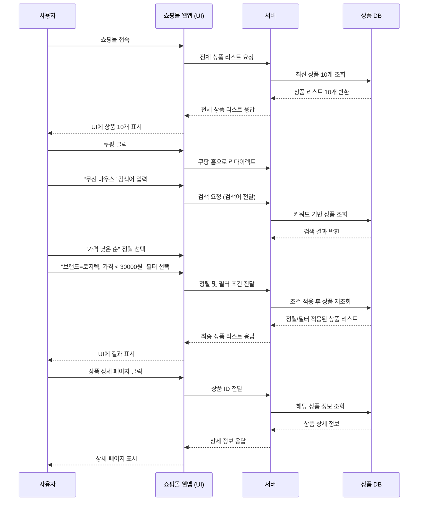

# 🌟 소프트웨어 공학 - 개인과제

- '일상속 상품 검색 기능'을 구현한 프로젝트


---

## 1. 프로젝트 개요

* 사용자가 상품을 검색하고 조건(브랜드 / 가격)에 맞는 검색결과 보기
* 반환된 검색 결과에서 하나를 선택하여 상세정보 확인
  


---

## 2. 프로젝트 프로세스 플로우차트 (Mermaid Flowchart)

## 🔗 Mermaid 시퀀스 다이어그램

[▶ Mermaid 다이어그램 열기](https://www.mermaidchart.com/play?utm_source=mermaid_live_editor&utm_medium=toggle#pako:eNqdVE1rGlEU_SsXIZBAYk3TlbSBBjfuCkW6cWPNUFzUWDXdlIIfk9RE02gaW6OjjCU1pDVlohMwIPS_dDnvvv_Qq-9px4xjSmc1zJx77znnvvPeeaI724rH70kpb3aVeFQJxCKvkpHX4TjQs7QEmOti_RJb5VVAXcWeCZjP8pMCYNvg9RL83j8Bq5fB_MH4FfUq07sPeFXlqiG-5LOoDoD1TWtgWLclvMhgszZpxptl1lHDcTEvEUmmY9FYIhJPQyilJCGS-kvACXmhvHyaSIxBH4a8WmHfDcDGLVavYTkUXHEWPFeSb2VXVWM91Yl4ltzZ3o2mA1tjkFAa2JrwIz983js-sE4XD8_54QDQLJBEYG2NfdJEwUjE2uamIOq309QruH8kQOIvwQQ9v_uA-in2rkSRwFLRlDHV3WhY1Cd16z7L0OSaRM0UumYfdneKqGNGjZ_VZmbZhbgxbFZY8WZGFlWNXPBDKIhfyrPkeIUIazZ3173AT0us9YMfD2lHOs835xv5S-elNvCsyTpXbi5KzFkBtSEtZUSTFc-xaTL9gMjaxj70yjM8d1jYw7omkQF2UcC6QVLDHonHz2RCa4_p31xIyGiIzcGyrUpXWbG74r5MnjvHRolOEtChom3M5m7BQuVIq2dY_eF0j1OtG14ZUvp1DDKoqGcpZC7qLSNj9S6B5X5iMwNY0Ei-bLFgReTagDY5ysITcp9iz_eOVkE2ewwbPnqwUaZmExK2ZnMy4eDcNqzriZELQjGBjRQCb6hTI1vd-8Mxc52JHqysOQ6-a04okV_3_icncn2OhDzyzt6o8-MhFQog_1ijQ08LuCcvoigYuNdSXjVZ8XY6hTzqm_980UhSosrVNztooVtOjWPHPO__AAJKRJI)

😄 **Mermaid실행 화면**


<br>
<br>

😄 **Mermaid SequenceDiagram 화면**

<br><br>




---

## 3. 구현을 위한 파이썬 코드
```
# shopping_flow.py

from typing import List, Optional

# 상품 클래스
class Product:
    def __init__(self, product_id: int, name: str, brand: str, price: int):
        self.product_id = product_id
        self.name = name
        self.brand = brand
        self.price = price

    def __repr__(self):
        return f"{self.name} ({self.brand}) - {self.price}원"

# 상품 저장소 (데이터)
class ProductRepository:
    def __init__(self):
        self.products = [
            Product(1, "로지텍 무선 마우스", "로지텍", 25000),
            Product(2, "HP 유선 마우스", "HP", 15000),
            Product(3, "로지텍 게이밍 마우스", "로지텍", 45000),
            Product(4, "삼성 블루투스 마우스", "삼성", 29000),
            Product(5, "LG 유선 마우스", "LG", 18000),
            Product(6, "로지텍 무선 키보드", "로지텍", 32000),
            Product(7, "애플 매직 마우스", "애플", 79000),
            Product(8, "델 유선 마우스", "델", 14000),
            Product(9, "MS 블루투스 마우스", "MS", 31000),
            Product(10, "로지텍 사일런트 마우스", "로지텍", 27000),
        ]

    def get_latest_products(self, count: int = 10) -> List[Product]:
        return self.products[:count]

    def search(self, keyword: str) -> List[Product]:
        return [p for p in self.products if keyword in p.name]

    def filter(self, products: List[Product], brand: Optional[str], max_price: Optional[int]) -> List[Product]:
        filtered = products
        if brand:
            filtered = [p for p in filtered if p.brand == brand]
        if max_price:
            filtered = [p for p in filtered if p.price <= max_price]
        return filtered

    def get_detail(self, product_id: int) -> Optional[Product]:
        for p in self.products:
            if p.product_id == product_id:
                return p
        return None

# 웹 앱 로직
class WebApp:
    def __init__(self, repository: ProductRepository):
        self.repo = repository

    def load_home(self):
        return self.repo.get_latest_products()

    def search_products(self, keyword: str, brand: Optional[str], max_price: Optional[int]):
        result = self.repo.search(keyword)
        return sorted(self.repo.filter(result, brand, max_price), key=lambda x: x.price)

    def show_detail(self, product_id: int):
        return self.repo.get_detail(product_id)

# 사용자 시뮬레이션
class User:
    def __init__(self, app: WebApp):
        self.app = app

    def run(self):
        print("📲 쇼핑몰 접속")
        latest = self.app.load_home()
        print("🛒 최신 상품 리스트:")
        for p in latest:
            print("-", p)

        print("\n🔍 '마우스' 검색 + 로지텍 브랜드 + 가격 ≤ 30000원")
        filtered = self.app.search_products("마우스", "로지텍", 30000)
        for p in filtered:
            print("🎯 검색결과:", p)

        if filtered:
            detail = self.app.show_detail(filtered[0].product_id)
            print("\n📄 상세 페이지:")
            print("📝", detail)

# 실행
if __name__ == "__main__":
    repo = ProductRepository()
    app = WebApp(repo)
    user = User(app)
    user.run()

```


### 사용 클래스:


### 구현 목적:


---

## 4. 파이썬 코드 클래스 구조

```plaintext
shopping_flow.py
|
|│-- Product: 상품의 정보 (이름, 가격, 브랜드)
|│-- ProductStore: 전체/검색/필터/상세 조회 가능
|│-- User: 가입 행동을 시루리얼로 실행
```

---

## 5.

| 키점     | 가지가 있다         | 판단 |
| ------ | -------------- | -- |
| 개발 단순성 | 클래스 3개 이하      | 가능 |
| 유지법    | 클래스간 가능한 최소 가열 | 가능 |
| 검증효    | 다양한 검증자 만들기 여유 | 가능 |

---

## 6. 결론

---
