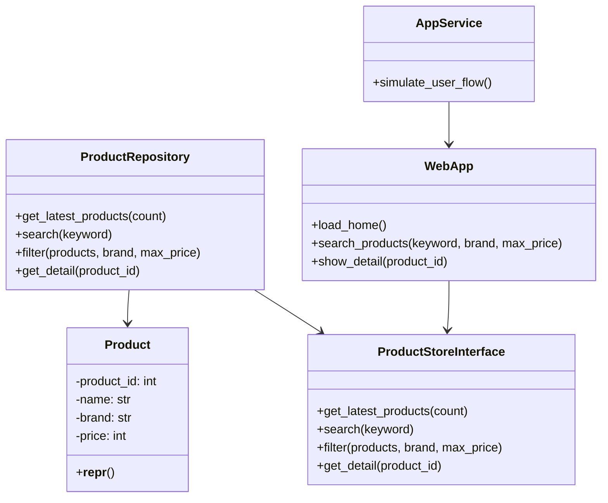

```mermaid
classDiagram
    class Product {
        -product_id: int
        -name: str
        -brand: str
        -price: int
        +__repr__()
    }

    class ProductStoreInterface {
        +get_latest_products(count)
        +search(keyword)
        +filter(products, brand, max_price)
        +get_detail(product_id)
    }

    class ProductRepository {
        +get_latest_products(count)
        +search(keyword)
        +filter(products, brand, max_price)
        +get_detail(product_id)
    }

    class WebApp {
        +load_home()
        +search_products(keyword, brand, max_price)
        +show_detail(product_id)
    }

    class AppService {
        +simulate_user_flow()
    }

    ProductRepository --> Product
    ProductRepository --> ProductStoreInterface
    WebApp --> ProductStoreInterface
    AppService --> WebApp
```